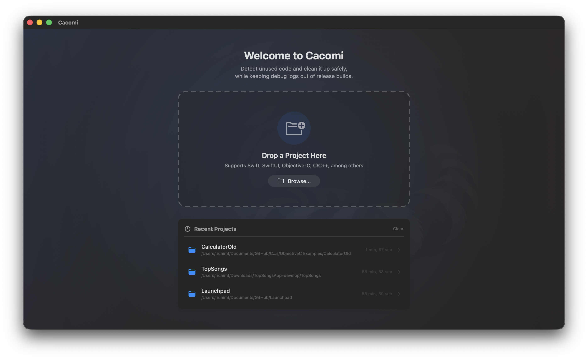
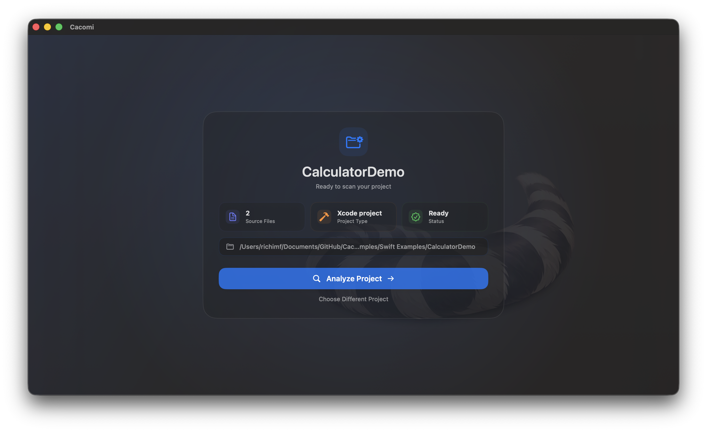
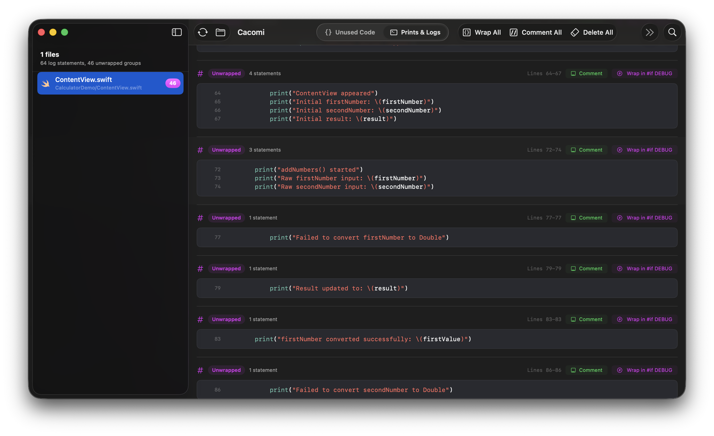
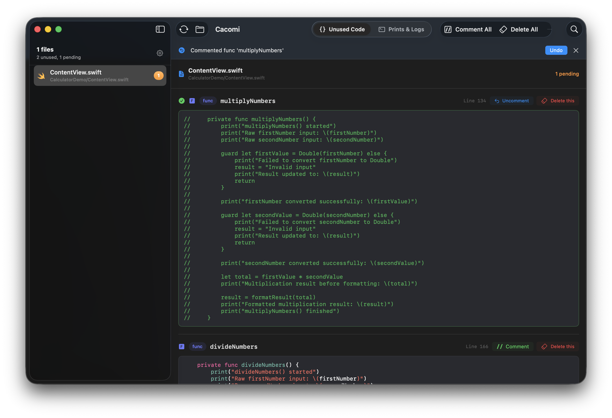
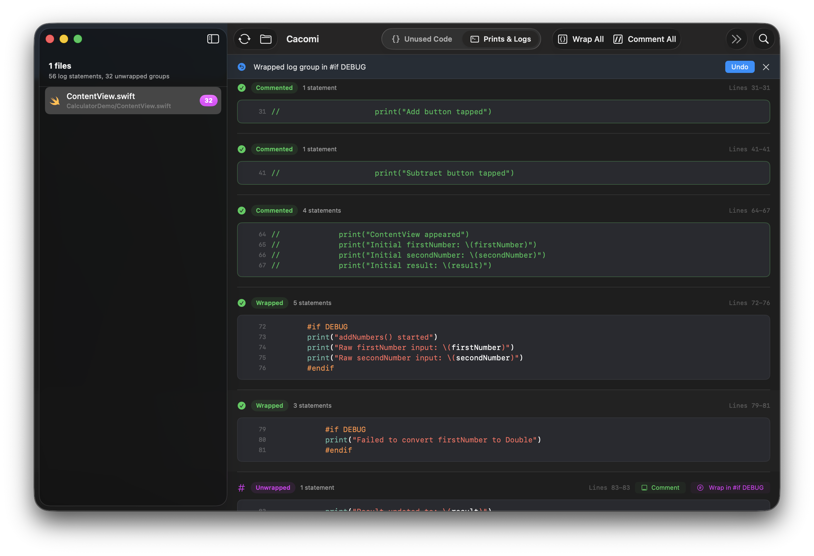
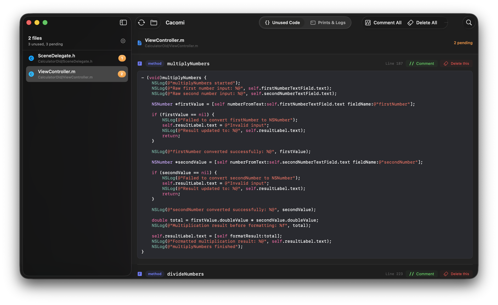
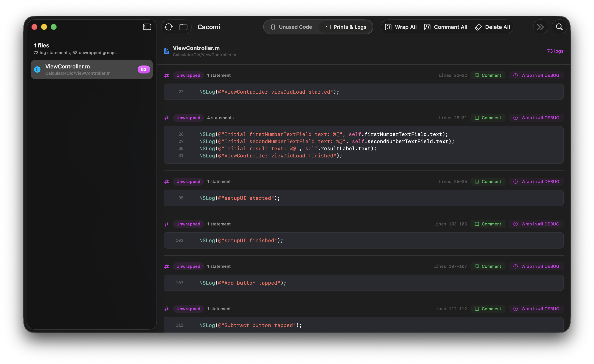
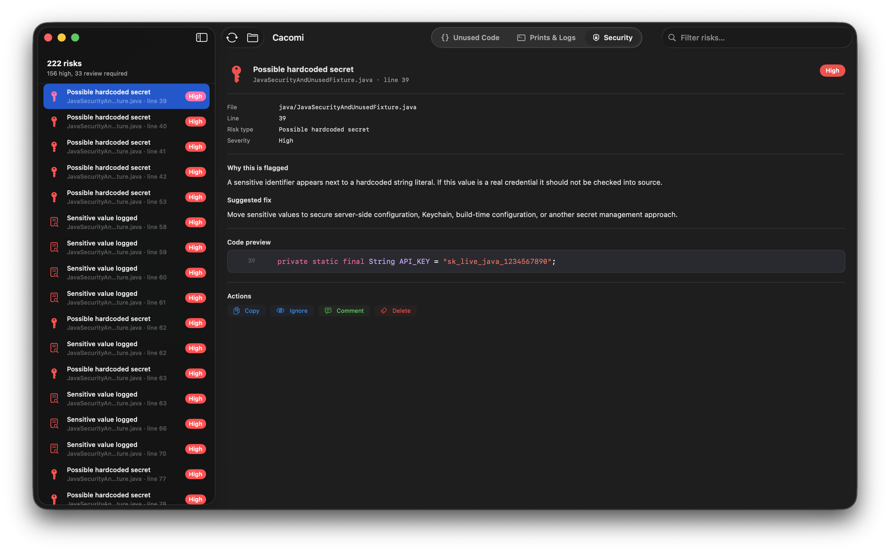
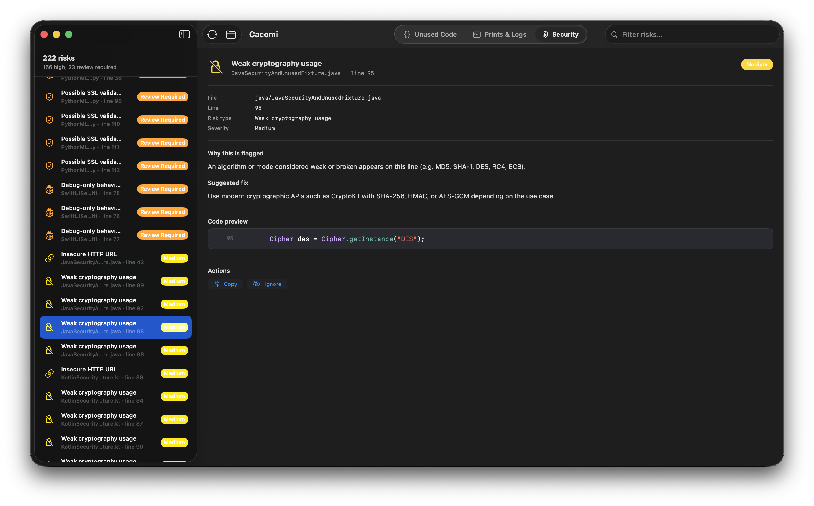

# Cacomi - Example Projects

## Sample Projects for App Review

This repository contains sample projects that App Review can use to verify the main features and functionality of **Cacomi**.

**Cacomi** is a macOS developer tool that analyzes app project source files and helps identify:

- Potentially unused Swift code
- Potentially unused SwiftUI code
- Potentially unused Objective-C code
- Debug logging statements such as `print`, `debugPrint`, `NSLog`, and similar calls
- Code sections that can be reviewed, commented out, deleted, or wrapped in debug-only compilation blocks

These sample projects are provided specifically so App Review can test the app without needing to supply their own project files.

## How the App Works

1. Open Cacomi on macOS.
2. Click **Analyze Project**.
3. Select one of the sample project folders included in this repository.
4. Cacomi scans the supported source files in the selected project.
5. The app displays files and code sections that may contain unused code or debug logging statements.
6. Select any result to preview the detected code.
7. Use the available actions to comment out code, delete code, wrap debug logs inside `#if DEBUG` blocks, or undo the last action.
8. After each action, the preview updates and Cacomi recalculates the remaining detected items.

## Sample Projects Included

This repository includes small example projects designed to trigger different parts of the app analysis.

### Example projects are located in:

```text
Examples/SwiftExamples/CalculatorDemo
Examples/ObjectiveCExamples/CalculatorOld

```
**You can review all features at the same time** by scanning the folder: `multilanguage_examples`.


## Screenshots 

### 1. Open Cacomi
Start by opening Cacomi and choosing a project to analyze. You can drag and drop a supported project folder into the drop area.


### 2. Analyze the project
After selecting a project, Cacomi scans the supported source files and looks for potentially unused code and debug logging statements.


### 3. Preview the Prints
The **Prints & Logs** tab shows detected debug statements such as `print`, `debugPrint`, `NSLog`, and similar logging calls. Select any result to preview the exact code before making changes.



### 4. Review Detected Unused Code and Comment It, also you can delete it.

Cacomi shows potentially unused code with a preview of the detected section. Review each result, then choose whether to comment it out or delete it from the selected sample project.


### 5. You can Wrap the print() blocks of code as well
Detected print or log blocks can be wrapped inside debug-only compilation blocks, such as `#if DEBUG ... #endif`, so they are excluded from release builds.


### 6. It supports Objective-C projects too.
Cacomi also supports Objective-C projects. It can detect potentially unused Objective-C methods and logging statements such as `NSLog`.

Objective-C log results can be previewed, commented, deleted, or wrapped in debug-only blocks just like Swift and SwiftUI results.





### 7. The app can look for static security issues.

Cacomi also supports static security scanning to help you identify common risky patterns directly inside your project.

The Security tab can detect potential issues such as hardcoded secrets, unsafe APIs, insecure network usage, risky debug code, and other patterns that may need review before release. Results are grouped by file, with a code preview so you can quickly inspect each finding and decide what to fix.

This feature is designed as a lightweight static analysis helper for developers. It does not replace a full security audit, but it helps you catch obvious issues early while cleaning and reviewing your code.





